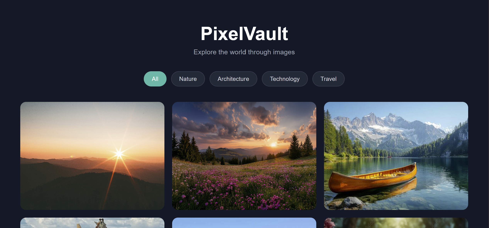

# PixelVault - Responsive Image Gallery

PixelVault is a modern, responsive image gallery built using HTML, CSS, and JavaScript.

The project allows users to browse images by category and view them in an interactive lightbox.

## Live Demo

[View Live Demo](https://zaeemdanish007-hub.github.io/CodeAlpha-image-gallery/)

## Preview



## Features

- Responsive image gallery
- 24 images across 4 categories
- Nature, Architecture, Technology, and Travel categories
- Category filtering
- Interactive lightbox
- Next and Previous image navigation
- Keyboard navigation using Arrow keys
- Escape key to close the lightbox
- Click outside the image to close
- Image counter
- Hover zoom effects
- Smooth CSS transitions
- Responsive design for desktop, tablet, and mobile

## Technologies Used

- HTML5
- CSS3
- JavaScript

## Project Structure

```text
image-gallery/
├── assets/
│   └── preview.png
├── index.html
├── style.css
├── script.js
└── README.md
```

## What I Learned

While building this project, I practiced:

- Creating responsive layouts with CSS Grid
- Working with CSS media queries
- Adding hover effects and transitions
- Manipulating the DOM with JavaScript
- Handling click and keyboard events
- Creating an interactive lightbox
- Implementing image filtering
- Working with JavaScript arrays and indexes

## Author

**Zaeem Danish**

BS Software Engineering Student
Frontend Developer
